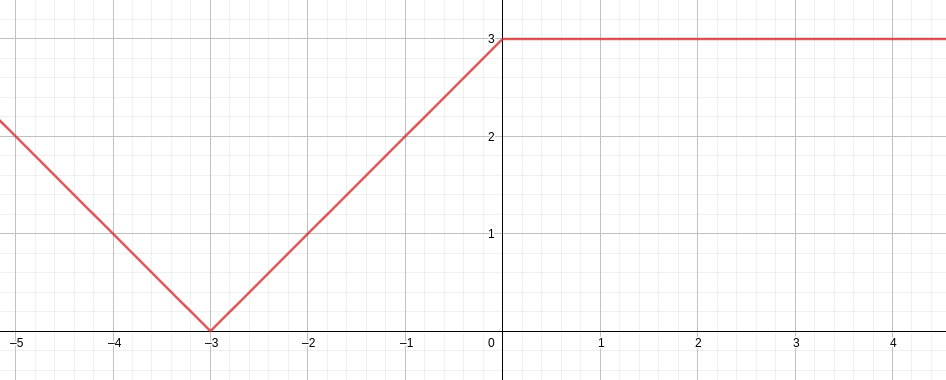

# Booléens


Une valeur booléenne est soit true (vrai) soit false (faux). Par exemple, on peut tester l'égalité de deux valeurs avec `=` :

```ocaml
3 = 1 + 2
```

On peut comparer des valeurs numériques avec `<` (inférieur strict), `>`, `<=` (inférieur ou égal), `>=`, `<>` (différent)... :

```ocaml
2 < 1
```

Il faut obligatoirement comparer des valeurs de même type :

```ocaml
2.4 < 3 (* on ne peut pas comparer un float avec un int *)
```

```ocaml
2.4 < 3.0 (* par contre ceci fonctionne *)
```

Les opérateurs `&&` (et), `||` (ou), `not` permettent de combiner des conditions :

```ocaml
1 < 2 && 2 < 3
```

```ocaml
let a = 0 in
a <> 0 || a > 3 (* test si a est différent de 0 ou supérieur à 3 *)
```

<!-- #region -->
**Exercice**

1. Quelle est la valeur du code suivant?
```ocaml
let a = 42 in
not (a = 12 && (a < 10 || a > 30))
```
2. Comment aurait-on pu écrire `not (a = 12 && (a < 10 || a > 30))` sans `not`?
<!-- #endregion -->

<!-- #region -->
# Condition if

On peut écrire une condition `if` de la façon suivante en OCaml :
```ocaml
if ... then ... else ...
```
La condition du `if` doit être un booléen. Si la condition est vraie, le `then` est exécuté et sa valeur est renvoyé. Sinon, c'est le `else` :  
<!-- #endregion -->

```ocaml
if 1 = 2 then 42 else 24
```

Définissons par exemple la fonction valeur absolue ($x \longmapsto \vert x \vert$) :

```ocaml
let abs x =
    if x < 0 then -x
    else x
```

```ocaml
abs (-42)
```

Pour plus de lisibilité on sautera une ligne avant `then` et `else`, sauf si le contenu du `if` est très court.


**Exercice** Définir les fonctions suivantes en OCaml :  
1.


2. 



3. 


```ocaml
let f1 x = 
    if x < 1. then 2 (* l'argument de f1 doit être un float donc il faut le comparer à un float *)
    else 1;;
```

```ocaml
let f1 x = 
    if x < 0 then abs (x + 3) 
    else 3;;
```

**Exercice** Écrire une fonction `n_solutions : float -> float -> float -> int` telle que `n_solutions a b c` renvoie le nombre de solutions de l'équation $ax^2 + bx + c$.

```ocaml
let n_solutions a b c =
    let delta = b**2. -. 4.*.a*.c in
    if delta > 0. then 2
    else if delta < 0. then 0
    else 1
```

```ocaml
n_solutions 3. 5. 2.
```

```ocaml

```
